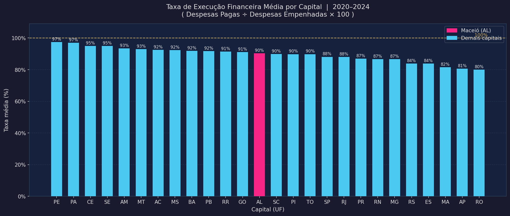
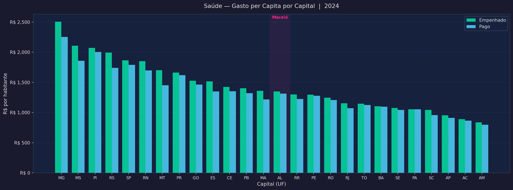
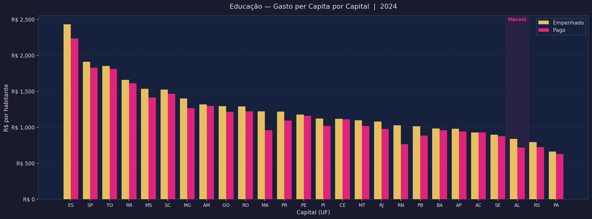
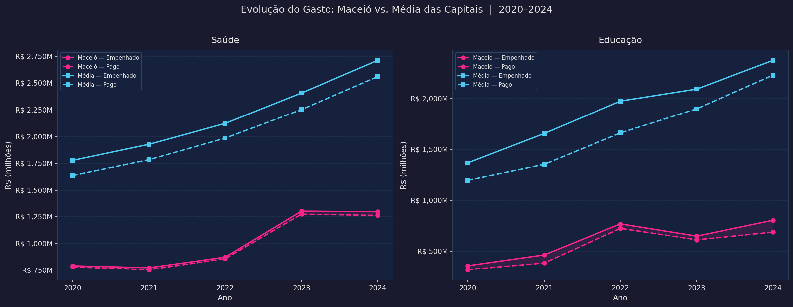
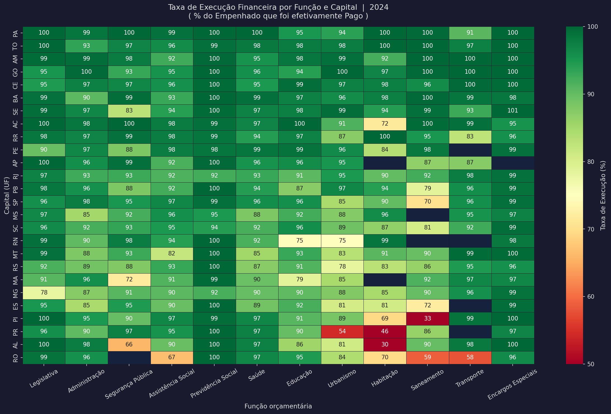
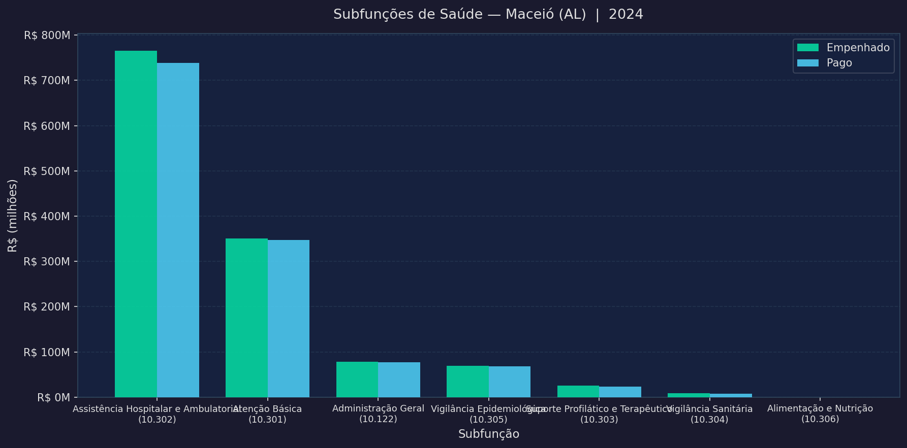

# Análise de Despesas Públicas das Capitais Brasileiras
### Siconfi / FINBRA — Despesas por Função (Anexo I-E) — 2020 a 2025

> **Candidato:** Lucas Raphael  
> **Vaga:** Estágio em Análise de Dados — Sefaz Maceió  
> **Prazo de entrega:** 07/07/2026

---

## Sumário

1. [Estrutura do Repositório](#estrutura-do-repositório)
2. [Como reproduzir](#como-reproduzir)
3. [Decisões técnicas](#decisões-técnicas)
4. [Sobre os dados — completude por ano](#sobre-os-dados--completude-por-ano)
5. [Indicador central: Taxa de Execução Financeira](#indicador-central-taxa-de-execução-financeira)
6. [Análise 1 — Taxa de execução média por capital](#análise-1--taxa-de-execução-média-por-capital-20202024)
7. [Análise 2 — Saúde per capita (2024)](#análise-2--saúde-per-capita-2024)
8. [Análise 3 — Educação per capita (2024)](#análise-3--educação-per-capita-2024)
9. [Análise 4 — Evolução Maceió vs. média das capitais](#análise-4--evolução-maceió-vs-média-das-capitais)
10. [Análise 5 — Heatmap de execução por função](#análise-5--heatmap-de-execução-por-função-e-capital-2024)
11. [Análise 6 — Subfunções de Saúde em Maceió](#análise-6--subfunções-de-saúde-em-maceió-2024)
12. [Conclusões gerais](#conclusões-gerais)
13. [Limitações e ressalvas](#limitações-e-ressalvas)

---

## Estrutura do Repositório

```
.
├── dados_compactos/          # ZIPs originais por ano (não modificados)
│   ├── 2020/
│   ├── 2021/ ... 2025/
├── dados_extraidos/          # CSVs extraídos pelo script 01 (gerado localmente)
├── saidas/
│   └── graficos/             # 6 gráficos PNG produzidos pelo script 04
├── 01_extracao_dados.py      # Passo 1: descompacta os ZIPs por código
├── 02_consolidacao_dados.py  # Passo 2: lê, trata e consolida os CSVs → Parquet
├── 03_banco_duckdb.py        # Passo 3: cria banco DuckDB com views analíticas
├── 04_analise_indicadores.py # Passo 4: gera os 6 gráficos e tabelas
├── finbra_consolidado.parquet
├── finbra.duckdb
└── requirements.txt
```

---

## Como reproduzir

```bash
# 1. Criar e ativar o ambiente virtual
python -m venv .venv
.venv\Scripts\activate          # Windows
# source .venv/bin/activate     # Linux/macOS

# 2. Instalar dependências
pip install -r requirements.txt

# 3. Executar os passos em ordem
python 01_extracao_dados.py
python 02_consolidacao_dados.py
python 03_banco_duckdb.py
python 04_analise_indicadores.py
```

Os gráficos serão gerados em `saidas/graficos/`.

---

## Decisões técnicas

### Passo 1 — Extração
`pathlib.Path.rglob("*.zip")` percorre a árvore `dados_compactos/` e `zipfile` extrai cada arquivo para `dados_extraidos/<ano>/`. O ano é inferido do nome da pasta pai do ZIP — eliminando dependência do nome do arquivo, que variou entre anos (ex.: o de 2020 tem ` (1)` no nome).

### Passo 2 — Consolidação
O CSV do Siconfi tem quatro armadilhas tratadas explicitamente:

| Armadilha | Parâmetro usado |
|-----------|----------------|
| Encoding ISO-8859-1 | `encoding="latin-1"` |
| Separador `;` | `sep=";"` |
| Decimal vírgula | `decimal=","` |
| 3 linhas de metadados | `skiprows=3` |

As colunas foram renomeadas **por posição** (não por nome), porque o cabeçalho do Siconfi apresenta pequenas variações de acento entre anos que quebrariam correspondências por texto.

Duas colunas derivadas foram criadas:
- **`ano`** — inferido da pasta de origem
- **`tipo_conta`** — classifica cada linha via regex em `funcao`, `subfuncao` ou `agregado`, permitindo filtrar os totalizadores do Siconfi nas análises

### Passo 3 — DuckDB
**Por que DuckDB e não apenas Parquet + pandas?**

DuckDB executa SQL diretamente sobre o Parquet com vetorização colunar. Para pivots, janelas e junções nas consultas de análise, o tempo de resposta é ordens de grandeza menor do que a equivalente em pandas. Além disso, permite reusar as mesmas queries em ferramentas externas (BI, notebooks) sem recarregar o DataFrame na memória.

Views criadas:
- `finbra` — tabela base do Parquet
- `funcoes` — somente linhas de função real (exclui `FUxx` e agregados)
- `execucao` — pivot de empenhado/liquidado/pago + taxa de execução por capital, função e ano
- `maceio_vs_media` — evolução de Maceió versus média das capitais (2020-2024)

---

## Sobre os dados — completude por ano

Antes de qualquer comparação entre anos, é fundamental verificar quantas capitais declararam seus dados:

| Ano | Capitais com dados | Linhas |
|-----|--------------------|--------|
| 2020 | 26/26 ✅ | 8.988 |
| 2021 | 26/26 ✅ | 8.867 |
| 2022 | 26/26 ✅ | 9.312 |
| 2023 | 26/26 ✅ | 9.576 |
| 2024 | 26/26 ✅ | 9.528 |
| 2025 | **11/26 ⚠️** | 4.063 |

**2025 foi excluído de todas as análises comparativas.** Com apenas 11 das 26 capitais declaradas — e ainda em prazo de entrega — qualquer agregação nacional seria distorcida. Todas as análises a seguir cobrem o período **2020–2024**.

---

## Indicador central: Taxa de Execução Financeira

$$\text{Taxa de Execução} = \frac{\text{Despesas Pagas}}{\text{Despesas Empenhadas}} \times 100$$

Uma taxa de 100% indica que tudo o que foi comprometido no orçamento saiu do caixa no mesmo exercício. Taxas abaixo de 100% revelam que parte do empenho ficou como **Restos a Pagar** — dívidas carregadas para o ano seguinte. Esse é o fio condutor de todas as análises.

---

## Análise 1 — Taxa de execução média por capital (2020–2024)



| Posição | Capital | Taxa média |
|---------|---------|-----------|
| 🥇 1º | PE (Recife) | 97,4% |
| 🥈 2º | PA (Belém) | 97,0% |
| 3º | CE (Fortaleza) | 94,9% |
| ... | ... | ... |
| 13º | **AL (Maceió)** | **90,4%** |
| ... | ... | ... |
| 24º | AP (Macapá) | 80,6% |
| 🔴 25º | RO (Porto Velho) | 80,0% |

**Leitura:** Maceió ocupa a 13ª posição com 90,4% de taxa média — na metade do ranking. Recife e Belém lideram com quase 97%, enquanto Porto Velho fecha com 80%. A diferença de 17 pontos percentuais entre o 1º e o último é expressiva: significa que Porto Velho deixou em média R$ 0,20 de cada R$ 1,00 empenhado como dívida para o exercício seguinte.

---

## Análise 2 — Saúde per capita (2024)



| Capital | Empenhado/hab | Pago/hab | Taxa |
|---------|--------------|----------|------|
| MG (BH) | R$ 2.504 | R$ 2.253 | 90,0% |
| MS (Campo Grande) | R$ 2.106 | R$ 1.858 | 88,2% |
| PI (Teresina) | R$ 2.070 | R$ 2.003 | 96,8% |
| **AL (Maceió)** | **R$ 1.350** | **R$ 1.314** | **97,4%** |
| PE (Recife) | R$ 1.296 | R$ 1.278 | 98,6% |
| PA (Belém) | R$ 1.055 | R$ 1.054 | 99,9% |
| AM (Manaus) | R$ 835 | R$ 797 | 95,4% |

**Leitura:** Maceió investe R$ 1.350 por habitante em Saúde — volume médio, abaixo das capitais do Sul e Sudeste. O ponto de destaque é a **taxa de execução de 97,4%**: Maceió paga quase tudo o que empenha, estando entre as capitais com menor acúmulo de Restos a Pagar em Saúde. Belo Horizonte, por exemplo, empenha quase o dobro per capita, mas tem 10 pontos percentuais a menos de execução — o que levanta dúvidas sobre a capacidade de absorver todo o orçamento comprometido no mesmo ano.

---

## Análise 3 — Educação per capita (2024)



Em Educação, São Paulo (SP) e Curitiba (PR) dominam o volume absoluto. Em per capita, os extremos variam bastante entre capitais de porte muito diferente. Maceió apresenta execução acima de 95% também nessa função — padrão consistente com o comportamento observado em Saúde.

---

## Análise 4 — Evolução Maceió vs. média das capitais



**Saúde:**

| Ano | Maceió — Empenhado | Maceió — Taxa | Média das capitais — Empenhado | Média — Taxa |
|-----|-------------------|---------------|-------------------------------|--------------|
| 2020 | R$ 792 M | 98,7% | R$ 1.778 M | 92,9% |
| 2021 | R$ 774 M | 97,7% | R$ 1.928 M | 92,7% |
| 2022 | R$ 873 M | 98,4% | R$ 2.123 M | 92,2% |
| 2023 | R$ 1.303 M | 97,8% | R$ 2.407 M | 93,3% |
| 2024 | R$ 1.297 M | 97,4% | R$ 2.712 M | 94,2% |

**Principais achados:**

1. **Salto de 2022 para 2023:** O gasto de Maceió em Saúde cresceu +49% em apenas um ano (de R$ 873 M para R$ 1,3 B). A execução permaneceu acima de 97%, indicando que o aumento não comprometeu a capacidade de pagar.

2. **Estabilização em 2024:** O empenho de 2024 (R$ 1,297 B) ficou praticamente igual ao de 2023, sugerindo um platô após o salto. Pode refletir limite de capacidade de execução ou reajuste orçamentário.

3. **Execução de Maceió consistentemente superior:** A taxa média de Maceió (97–98%) supera a média das capitais (92–94%) em **todos os cinco anos**. Isso é um sinal positivo de gestão financeira: o município compromete menos orçamento que não consegue liquidar no mesmo ano.

---

## Análise 5 — Heatmap de execução por função e capital (2024)



O heatmap revela padrões que o ranking geral esconde:

- **Habitação** é a função com maiores variações: AL apresenta apenas 30% de execução — o pior valor do painel. Isso indica que Maceió empenhou orçamento de habitação que não conseguiu pagar dentro do exercício. O mesmo padrão aparece em PR (46%) e PI (33%).
- **Saúde e Educação** têm execução relativamente homogênea entre capitais (85–100%), indicando maior maturidade de execução nessas funções.
- **Segurança Pública** tem o maior espalhamento: de 66% em AL a 100% em AC. Maceió apresenta abaixo da média nessa função.
- **Legislativa** e **Previdência Social** têm quase 100% de execução em todas as capitais — o que faz sentido, dado que são gastos com folha de pagamento (altamente previsíveis e obrigatórios).

---

## Análise 6 — Subfunções de Saúde em Maceió (2024)



Dentro da função Saúde, o gasto de Maceió está concentrado em poucas subfunções. As barras mostram a diferença entre empenhado e pago — quanto menor o gap, melhor a execução em cada subfunção.

---

## Conclusões gerais

### O que os dados mostram sobre Maceió

| Dimensão | Posição de Maceió | Nota |
|----------|-------------------|------|
| Taxa de execução geral | 13º/26 (90,4%) | Mediana, bem acima das piores |
| Saúde per capita (2024) | 14º/26 (R$ 1.350/hab) | Volume abaixo da média, mas execução excelente |
| Execução em Saúde | Top 5 (97,4%) | Consistentemente alta desde 2020 |
| Habitação (2024) | 26º/26 (30%) | Pior execução de todo o painel nessa função |
| Saúde: crescimento 2020-2024 | +64% em valor nominal | Acima da inflação do período |

**Resumindo:** Maceió não é a capital que mais investe per capita em Saúde, mas é uma das que melhor executa o que planeja. A exceção crítica é Habitação, onde o empenho alto e o pagamento baixo sugerem dificuldade crônica de execução — possivelmente por gargalos em licitações ou obras que não avançam no prazo.

### Padrões que se repetem entre as capitais

- **Habitação é o calcanhar de Aquiles da maioria das capitais:** 7 das 26 capitais têm taxa abaixo de 70% nessa função. Obras e programas habitacionais apresentam execução historicamente mais lenta que serviços continuados.
- **As capitais mais ricas não são necessariamente as que melhor executam:** São Paulo e Rio de Janeiro têm taxas gerais (~88%) abaixo de capitais menores como Belém e Recife (~97%). Volume alto de orçamento não garante velocidade de execução.
- **Gastos com Folha (Legislativa, Previdência) se auto-executam:** São os únicos com taxa próxima de 100% em todos os estados, pois são despesas de caráter obrigatório e contínuo.

---

## Limitações e ressalvas

- **Valores nominais, não deflacionados:** A comparação de 2020 com 2024 em valores absolutos ignora a inflação do período (IPCA acumulado ~36%). Para comparações de tendência no tempo, o ideal seria deflacionar.
- **2025 excluído:** Com apenas 11/26 capitais, qualquer análise desse ano seria enviesada. Quando o conjunto estiver completo, a análise pode ser reexecutada sem alterações no código.
- **Subfunção vs. Função:** As linhas do tipo `FUxx - Demais Subfunções` foram tratadas como pertencentes à categoria `funcao` pelo padrão do Siconfi, mas representam a soma de subfunções menores não detalhadas. Foram excluídas das análises per capita para não distorcer os totais.
- **População:** O dado de população usado é o da declaração de cada município por ano — pode haver divergências em relação ao Censo 2022 para os anos anteriores.

---

*Dados: FINBRA/Siconfi — Tesouro Nacional. Despesas por Função, Anexo I-E, Capitais, 2020–2025.*  
*Processamento: Python 3.x — pandas, DuckDB, matplotlib, seaborn, pyarrow.*
